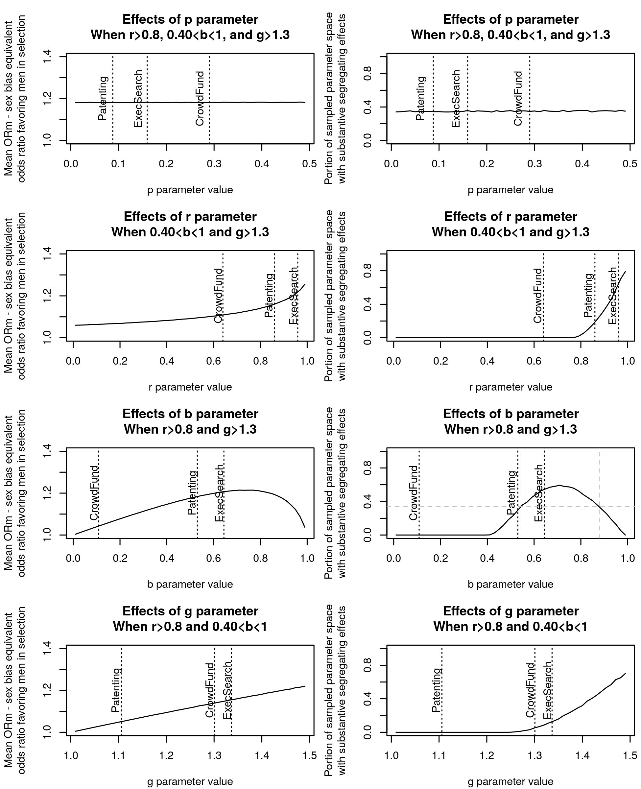

```{r setup, include=FALSE}
knitr::opts_chunk$set(echo = TRUE)
load("diff1k20211104.RData")
```

# Appendix

## Contents
1. Model Code
   + [Model](#model)
   + [Numeric Solution](#numeric-solution)
   + [Analytic Solution](#analytic-solution)
   + [Illustration of solution equivalence](#illustration-of-solution-equivalence)
     - [Figure A1. Numeric and Analytic Solution Equivalence - Distribution of Differences](#a1)
     - [Figure A2. Numeric and Analytic Solution Equivalence - Differences by Model Time](#a2)
   + [Time to equilibrium](#time-to-equilibrium)
     - [Figure A3. Time to Equilibrium - Model Time 0 to 10,000](#a3)
     - [Figure A4. Time to Equilibrium - Model Time 0 to 1,000](#a4)
   + [Sex Bias Equivalence](#sex-bias-equivalence)
2. [Calculating the confidence intervals for gender differences in reapplication](#calculating-the-confidence-intervals-for-gender-differences-in-reapplication)
3. Analysis for Proposition 1 Parameter Values
   + [Parameters in Real World Subset of Parameter Space](#prop1a)
     - [Figure A5. Effects of Individual Parameters in Real World Subset of Parameter Space](#a5)
   + [Parameters When r>0.80, 0.40<b<0.99, and g>1.3](#prop1a)
     - [Figure A6. Effects of Individual Parameters When r>0.80, 0.40<b<0.99, g>1.3](#a6)
4. Consideration of model variations
   + [Collecting selected applicants](#modeling-stocks-of-selected-applicants)
     - [Figure A7. Convergence of Equilibria - Model Differences by Model Time](#a7)
   + [Applicant quality interactions](#applicant-quality-interactions)
   + [Screening interactions](#screening-interactions)
5. Code for plots
   + [Figure 2](#figure-2)
   + [Figure 3](#figure-3)
   + [Figure 4](#figure-4)
   + [Figure 5](#figure-5)
   + [Figure 6](#figure-6)
6. References

# 1. Model Code

[top](#contents)

Our model analysis was implemented in R. We provide all code here.

## Model

[top](#contents)

```{r tidy=T}
model <- function (t, state, parms) {
  with(as.list(c(state, parms)), {
    #  Formulae for Men (M) and Women (W) as in the Paper
    dAM <- -AM + 1 - p + RM*b*g/(1+(b*g)-b) # Applying Men
    dAW <- -AW + p + RW * b                 # Applying Women
    dRM <- r*AM - RM                        # Rejected Men
    dRW <- r*AW - RW                        # Rejected Women
    list(c(dAM,dAW,dRM,dRW))
  })
}

# Initial values for model - all stocks set to zero
ini <- c(AM=0, AW=0, RM=0, RW=0)
```

The model numbers are in the terms of the number of first-time applicants. In these units, p women are first-time applicants and 1-p men are first-time applicants. Because the main outcome of the model -- women's share of the total applicant pool -- has no units, we chose units that help keep the model simple and clear.

## Numeric solution

[top](#contents)

We use the R package deSolve (Soetaert, Petzoldt, & Setzer 2010) to solve our model numerically.

```{r tidy=T}
require(deSolve)
# appModel Function numericaly solves the continuous model
# using the:
#   specified model parameter values;
#   provided initial conditions; 
#   designated number of rounds (500 by default for equilibrium); and
# returns the final women's share of the applicant pool.

appModel <- function(rounds=500,pParam,rParam,bParam,gParam){
  parmsOpen <- c(p=pParam,r=rParam,b=bParam,g=gParam) # specified model parametres
  outOpen <- ode(y = ini,                    # initial conditions, 
                 times = seq(0,rounds,0.01), # time horizon for model
                 func = model,               # call to model
                 parms = parmsOpen)          # parameters
  # return the final women's share of the applicant pool
  return(outOpen[dim(outOpen)[1],"AW"]/(outOpen[dim(outOpen)[1],"AW"]+outOpen[dim(outOpen)[1],"AM"]))
}
```

## Analytic solution

[top](#contents)

We determined the analytic solutions to our model using SageMathCell (Grout et al. 2021).

Inputs to SageMathCell giving the provided solutions are provided below. Note that to avoid naming difficulties arising from the stock of rejected applicants being called ‘R’ and one of the model parameters – the rejection rate - also using ‘r,’ for the input below, ‘s’ was used to indicate the rejection rate parameter. SageMathCell inputs to give the solution for women in the applicant pool over time:
>     var('t, p, s, b')
>     assume(t>=0)
>     assume(s>0,s<1)
>     assume(b>0,b<1)
>     assume(p>0,p<.5)
>     a = function('a')(t)
>     r = function('r')(t)
>     de1 = diff(a,t) - (-a+p+(r*b)) == 0
>     de2 = diff(r,t) - (s*a-r) == 0
>     desolve_system([de1,de2],[a,r],ics=[0,p,0],ivar=t)

SageMathCell inputs to give the solution for men in the applicant pool over time:
>     var('t, s, p, g, b')
>     assume(t>=0)
>     assume(s > 0, s < 1)
>     assume(p > 0, p < 0.5)
>     assume(g > 1)
>     assume(b > 0, b < 1)
>     a = function('a')(t)
>     r = function('r')(t)
>     de1 = diff(a,t) - (1-a-p+(r*b*g/(1+(b*g)-b)))==0
>     de2 = diff(r,t) - (s*a-r) == 0
>     desolve_system([de1,de2],[a,r],ics=[0,(1-p),0],ivar=t)

```{r tidy=T}
# women in applicant pool at time t
wT <- function(t,p,r,b){
  return((b*p*r*cosh(sqrt(b*r)*t)/(b*r - 1) + b*p*r*sinh(sqrt(b*r)*t)/((b*r - 1)*sqrt(b*r)))*exp(-t) - p/(b*r - 1))  
}
# men in applicant pool at time t
mT <- function(t,p,r,b,g){
  return(((b^2*g^2 - (b^2 - b)*g - (b^2*g^2 - (b^2 - b)*g)*p)*(b*g - b + 1)*r*sinh(sqrt((b*g - b + 1)*b*g*r)*t/(b*g - b + 1))/(sqrt((b*g - b + 1)*b*g*r)*(b*g*r - b*g + b - 1)) + (b^2*g^2 - (b^2 - b)*g - (b^2*g^2 - (b^2 - b)*g)*p)*r*cosh(sqrt((b*g - b + 1)*b*g*r)*t/(b*g - b + 1))/(b*g*r - b*g + b - 1))*exp(-t)/(b*g - b + 1) - (b*g - (b*g - b + 1)*p - b + 1)/(b*g*r - b*g + b - 1))
}
# women's share of the applicant pool at time t
wShareT <- function(t,p,r,b,g){
   womensShare <- wT(t,p,r,b)/(wT(t,p,r,b)+mT(t,p,r,b,g))
#   if (is.na(womensShare)){
#      womensShare <- appModel(t,p,r,b,g)
#   }
   return(womensShare)
}
```

## Illustration of solution equivalence

[top](#contents)

Numeric and analytic solutions to differential equation models give results that can be made identical to arbitrary levels of accuracy. The average result for randomly-sampled points in the model’s parameter space (including time) using the default numeric solution settings are outcomes that match to six decimal places. These very small differences between solutions are largest when model time is small. As model time increases, differences between these solutions approach zero.
```{r tidy=T}
# function compareSols takes no arguments
# it samples a random point in the model's parameter space (including time)
# and finds the women's share of the applicant pool 
# at that point in the parameter space using both 
# the numeric and analytical solutions from above.
# The function returns the difference (numerical - analytical) and the time step.
compareSols <- function(){
  # pick random values for model parameters within finite ranges
  pRand <- runif(1,min=0.01,max=0.49) # women's share of first-time applicants
  rRand <- runif(1,min=0.01,max=0.99) # rejection rate
  bRand <- runif(1,min=0.01,max=0.99) # rate of reapplication by rejected women
  gRand <- runif(1,min=1,max=10)      # odds ratio 
  tRand <- runif(1,min=10,max=1000)   # time 
  numSol <- appModel(tRand,pRand,rRand,bRand,gRand) # get the outcome - women's share of applicant pool - via the numeric solution
  frmSol <- wShareT(tRand,pRand,rRand,bRand,gRand)  # get the same outcome from the formal analytic solution
  return(c(time=tRand,
           diff=as.numeric(numSol - frmSol),
           numsol=numSol,
           frmSol=frmSol)) # return the difference between the 2 solutions
}

set.seed(100) # to reproduce shared results, use the same random seed
              # to generate new results, set a new seed or omit the prior line
# diff1k <- replicate(1000,compareSols()) # Note - may require an hour to complete
mean(diff1k[2,which(diff1k[4,]!=0)],na.rm=T) #  2.04 * 10^-6
max(diff1k[2,which(diff1k[4,]!=0)],na.rm=T)  #  6.67 * 10^-4
min(diff1k[2,which(diff1k[4,]!=0)],na.rm=T)  # -3.75 * 10^-15
```

### Figure A1. Numeric and Analytic Solution Equivalence - Distribution of Differences {#a1}

```{r tidy=T}
plot(density(diff1k[2,which(diff1k[4,]!=0)],na.rm=T),
     main="Difference between numeric and analytical solutions\n
     for randomly-selected points in parameter space") # note almost all results 
     # are indistinguishable from zero
```

### Figure A2. Numeric and Analytic Solution Equivalence - Differences by Model Time {#a2}

```{r tidy=T}
plot(x=diff1k[1,which(diff1k[4,]!=0)],
   y=diff1k[2,which(diff1k[4,]!=0)],       # plot difference as a function of model time
    xlab="model time value (t)", # note any differences come early in model time
    ylab="Numeric - Analytic Result",type="p")  
```

## Time to equilibrium

[top](#contents)

We find that t=500 is sufficient to achieve equilibrium throughout the model's parameter space. We determine equilibrium has been reached when there is no change in results to any of 16 decimal places between time t and time t+100.

```{r tidy=T}
# function time2Eq takes a specified maximum time "maxTime"
# and randomly samples parameter space and time t.
# At a sampled point, the analytical solution is calculated
# along with the analytical solution at the same parameter values when time is t+100.
# The difference between the 2 calculated solutions are returned.
# We are looking for the time when the differences go away.
time2Eq <- function(maxTime){
  # pick random values for model parameters within finite ranges
  pRand <- runif(1,min=0.01,max=0.49) # women's share of first-time applicants
  rRand <- runif(1,min=0.01,max=0.99) # rejection rate
  bRand <- runif(1,min=0.01,max=0.99) # rate of reapplication by rejected women
  gRand <- runif(1,min=1,max=10)      # gender difference in reapplication rates 
                                      # (odds ratio)
  tRand <- runif(1,min=10,max=maxTime)   # time 
  frmSol <- wShareT(tRand,pRand,rRand,bRand,gRand)  # get the same outcome
                                      # from the formal analytic solution
return(c(rParam=rRand,bParam=bRand,gParam=gRand,pParam=pRand, 
                      # return parameter values
         time=tRand,  # including time t
         out=frmSol,  # and the calculated women's share at time t
         out100=wShareT(tRand+100,pRand,rRand,bRand,gRand))) # and at time t+100.
}

# Running time2Eq 10,000 times and using maxTime = 10,000, 
# it is clear the model reaches equilibrium before t=1000
time2Eq1kMax10k <- replicate(10000,time2Eq(10000))
```

### Figure A3. Time to Equilibrium - Model Time 0 to 10,000 {#a3}

```{r tidy=T}
plot(time2Eq1kMax10k[5,which(time2Eq1kMax10k[7,]!=0)],
     time2Eq1kMax10k[6,which(time2Eq1kMax10k[7,]!=0)]-time2Eq1kMax10k[7,which(time2Eq1kMax10k[7,]!=0)],
     xlab="Model Time",
     ylab="t and t+100 Difference")
# Running time2Eq 10,000 times and using maxTime = 1,000, 
# it is clear the model reaches equilibrium before t=500
time2Eq1kMax1k <- replicate(10000,time2Eq(1000))
```

### Figure A4. Time to Equilibrium - Model Time 0 to 1,000 {#a4}

```{r tidy=T}
plot(time2Eq1kMax1k[5,which(time2Eq1kMax1k[7,]!=0)],
     time2Eq1kMax1k[6,which(time2Eq1kMax1k[7,]!=0)]-time2Eq1kMax1k[7,which(time2Eq1kMax1k[7,]!=0)],
     xlab="Model Time",
     ylab="t and t+100 Difference")
```

-----

Based on these results, we use t=500 for calculating women's share at equilibrium.

```{r tidy=T}
wShareEq <- function(p,r,b,g){
   return(wShareT(t=500,p=p,r=r,b=b,g=g))
}
```

## Sex Bias Equivalence

[top](#contents)

We calculate the odds ratio favoring men in selection that yields the same compositional changes as those from gender differences in reapplication (for a particular set of model parameters) as the sex bias equivalence (of that particular set of model parameters). The code for these calculations are below.


```{r tidy=T}
# Sex Bias Equivalence (SBE) function
# Gives the Odds Ratio favoring men in selection that yields the same
# women's share among selected as given by
# our gender differences in reapplication model at equilibrium
# for matching parameter values (p & r).
# The model returns the Odds ratio along with
# the acceptance rate for men and
# the acceptance rate for women that
# represent the sex bias equivalent.

sbe <- function(p,r,b,g){
   q <- wShareEq(p,r,b,g)
   s <- (((r*q) - q + p)*(1-q)) / (q *(q - (q*r) + r - p))
   return(c(oddsR = round(s,4),
            accM=round((r-1)*(q-1)/(1-p),4),
            accW=round((q-(q*r))/p,4)))
}
```

# 2. Calculating the confidence intervals for gender differences in reapplication

[top](#contents)

We employ numerical simulations to determine a 95% confidence interval for the gender difference in reapplication parameter ( _g_ ) in each of our three cases. We treat the probability of men's reapplication and probability of women's reapplication as a binomial random variable with the case-provided point estimates. We then run simulations of similarly-sized populations using those probabilities to generate a distribution of simulated gender differences in reapplication. We use the values that are +/- 1.96 standard deviations of this simulated distribution as the 95% CI for these values.

```{r tidy=T}
cases <- data.frame(caseID=c("ExecSearch",
                             "CrowdFund",
                             "Patenting"),
                    # MODEL PARAMETERS - g is calculated below
                    p=c(0.16,   # women's share
                        0.29,   # of first-time
                        0.088), # applicants
                    r=c(0.96,   # rejection rate
                        0.64,
                        0.86),
                    # OTHER CASE DATA
                    obs.m=c(21952, # count of men in each case
                            round(98131*(1-0.29),0),
                            round(3370800*(1-0.088),0)),
                    obs.w=c(1603, # count of women in each case
                            round(98131*0.29,0),
                            round(3370800*0.088,0)), 
                    pr.reapply.m=c(1-0.2924, #estimates of men's
                                   0.13672,  #reapplication
                                   0.5555),  #rates
                    pr.reapply.w=c( 1-0.3558,#estimates of
                                    0.10854, #women's re-
                                    0.5305)) #application rates
cases$b <- cases$pr.reapply.w
cases$g <- cases$pr.reapply.m*(1-cases$pr.reapply.w)/(cases$pr.reapply.w*(1-cases$pr.reapply.m))
getGs <- lapply(as.list(1:3),function(c){
  replicate(100000, # generates 100k instances of 
                    # g (odds ratio of men's higher rate of 
                    # reapplication relative to women)
            {m <- (rbinom(n=1,  # rbinom returns number of 
                                # successes (reapplications) 
                                # from the same number of men
                                # at men's case-identified 
                                # probability of reapplying
                    size=cases$obs.m[c],
                    prob=cases$pr.reapply.m[c])/cases$obs.m[c])
            # dividing by number of men yields
            # proportion of men who reapplied
            w <- (rbinom(n=1, # rbinom returns number of 
                         # successes (reapplications) from the 
                         # same number of women at women's 
                         # case-identified probability of 
                         # reapplying
                      size=cases$obs.w[c],
                      prob=cases$pr.reapply.w[c])/cases$obs.w[c])
            return(m*(1-w)/(w*(1-m))) # odds ratio of 
            # men's higher rate of reapplication
            })
})
# 95% CI taken from the simulated distribution
# lower-bound for g in the 95% CI
cases$glb <- cases$g - (unlist(lapply(getGs,quantile,probs=0.975))-unlist(lapply(getGs,quantile,probs=0.025)))/2 # lower bound of 95%CI
# upper-bound for g in the 95% CI
cases$gub <- cases$g + (unlist(lapply(
  getGs,
  quantile,
  probs=0.975))-
    unlist(lapply(
      getGs,
      quantile,
      probs=0.025)))/2 # upper bound of 95%CI
t(cases)
```

# 3. Analysis for Proposition 1 Parameter Values

## Parameters in Real World Subset of Parameter Space {#prop1a}

Our model provides another way to evaluate the relative contributions of our model parameters to the potential segregating effects of gender differences in reapplication. We can define a subset of the parameter space as the empirically supported parameter space. This subset of parameter space is bounded by values consistent with our observations from the cases. We can sample points in that parameter space at random and calculate the segregating effect of gender differences in reapplication when the parameter values are defined by that sampled point. The segregating effect is defined in terms of the ORM sex bias equivalent odds ratio favoring men in selection. When the ORM value is 1.2 or above, we determine the segregating effects at the parameter values defined by that sampled point to be substantial. By sampling a large number of points in the parameter space, we can determine an average segregating effect across that space along with a probability that a random point yields substantial segregation. 

If we follow this procedure for the parameter space defined by the following ranges of parameter values: _p_ $\epsilon$ {0.01..0.49}, _r_ $\epsilon$ {0.01..0.99}, _g_ $\epsilon$ {1.01..1.5}, _b_ $\epsilon$ {0.01..0.99}, then the average $OR_M$ is 1.06, and the probability that a point in the parameter space yields substantial segregation is around 0.017. This result - generated by sampling 100,000 points at random in the defined subset of parameter space - is consistent with the idea that substantial segregating effects from gender differences in reapplication are limited to parts of parameter space characterized by high rejection rates, values of _g_ of 1.3 or greater, and large but not extreme values of _b_. 

This same sampling approach can provide insights into the role of each model parameter on the potential segregating effects of gender differences in reapplication. When we focus on a particular parameter, we can fix that parameter to a certain value, and sample the rest of the parameter space holding that one parameter constant. By doing this repeatedly across a range of values for that parameter, we can map both an average segregating effect and the probability of a substantial segregating effect when the focal parameter takes on a specific value. 

We do this for the defined ranges of the four model parameters ( _p_, _r_, _b_, and _g_) and plot the results in Figure A5. The panels of Figure A5 on the left column plot the average segregating effect of each parameter when sampling 10,000 random points from parameter space at each point along the horizontal axis for each parameter. The panels of Figure A5 on the right column plot the portion of sampled points in parameter space for each value of the corresponding parameter that yield substantial segregation. 

In Figure A5, the plots for parameter _p_ - women's share of first-time applicants - both show a noisy horizontal line, indicating that variation in the women's share of first-time applicants does not influence the segregating effects of gender differences in reapplication. The plots for parameter _r_ - the rejection rate - shows a positive trendline with an increasing slope for the segregating effects, and a sharp increase in the portion yielding substantial segregation for values of _r_ above 0.80. The plots for parameter _b_ - women's reapplication rate - shows an inverted u-shaped curve for the average segregating effect, and a small bubble of the portion yielding substantial segregation for values of _b_ between 0.4 and 1. Finally, the plots for parameter _g_ - the odds ratio of men's higher reapplication rate - shows a linear increase in the average segregating effects and a sharp increase in the portion of substantial effects when _g_ goes above 1.3. 

In Figure A5, the portion of sampled points in parameter space yielding substantial segregation remains quite low. That portion is 0.017 for the defined subset of parameter space overall and doesn't rise above 0.25 in any one graph. But these features can be combined. In the next analysis, we examine the effects of these parameters in the range of values identified as potentially substantial in Figure A5, that is, when the rejection rate _r_ is 0.8 or above, when women's reapplication rate _b_ is between 0.4 and 1, and when the gender difference in reapplication rate is 1.3 or higher (up to 1.5).

```{r tidy=T}
randSbe <- function(p=runif(1,min=0.01,max=0.49),
                    r=runif(1,min=0.01,max=0.99),
                    b=runif(1,min=0.01,max=0.99),
                    g=runif(1,min=1.01,max=1.5)){
  sbe1 <- sbe(p,r,b,g)[1]
  return(c(sub=as.numeric(sbe1>=1.2),
           sbe=sbe1))
}

paramEffectsP <- function(iters=1000){
  paramRange <- as.numeric(seq(0.01,0.99,0.02))
  pctSub <- sapply(paramRange,function(param){
    apply(replicate(iters,randSbe(p=param)),
          MAR=1,FUN=mean,na.rm=T)})
  return(data.frame(pRange=paramRange,
                    pctSub=pctSub[1,],  # return the percent substantial
                    meanOR=pctSub[2,])) # return the mean OR_M
}
pEval <- paramEffectsP(10000)

paramEffectsR <- function(iters=1000){
  paramRange <- as.numeric(seq(0.01,0.99,0.02))
  pctSub <- sapply(paramRange,function(param){
    apply(replicate(iters,randSbe(r=param)),
          MAR=1,FUN=mean,na.rm=T)})
  return(data.frame(rRange=paramRange,
                    pctSub=pctSub[1,],  # return the percent substantial
                    meanOR=pctSub[2,])) # return the mean OR_M
}
rEval <- paramEffectsR(10000)

paramEffectsB <- function(iters=1000){
  paramRange <- as.numeric(seq(0.01,0.99,0.02))
  pctSub <- sapply(paramRange,function(param){
    apply(replicate(iters,randSbe(b=param)),
          MAR=1,FUN=mean,na.rm=T)})
  return(data.frame(bRange=paramRange,
                    pctSub=pctSub[1,],  # return the percent substantial
                    meanOR=pctSub[2,])) # return the mean OR_M
}
bEval <- paramEffectsB(10000)

paramEffectsG <- function(iters=1000){
  paramRange <- as.numeric(seq(1.01,1.49,0.02))
  pctSub <- sapply(paramRange,function(param){
    apply(replicate(iters,randSbe(g=param)),
          MAR=1,FUN=mean,na.rm=T)})
  return(data.frame(gRange=paramRange,
                    pctSub=pctSub[1,],  # return the percent substantial
                    meanOR=pctSub[2,])) # return the mean OR_M
}
gEval <- paramEffectsG(10000)
```


### Figure A5. Effects of Individual Parameters in Real World Subset of Parameter Space {#a5}

Effects of model parameters when sampling 10,000 random points in the parameter space for each x-axis value of the parameter in the figure. The observed parameter values from the three cases are given in each panel. The left column of graphs plot parameter effects in terms of the average sex bias equivalent odds ratio favoring men in selection ($OR_M$). The right column of graphs plot parameter effects in terms of the portion of sampled parameter space yielding substantive ($OR_M \geq 1.2$) segregating effects. 

```{r tidy=T}
par(mar=c(4.1,5.1,4.1,0.5),mfrow=c(4,2))

plot(x=pEval$pRange,
     y=pEval$meanOR,
     ylim=c(1,1.25),type="l",
     main="Effects of p parameter:\nWomen's share of first-time applicants",
     xlab="p parameter value",
     ylab="Mean ORm - sex bias equivalent\nodds ratio favoring men in selection")
abline(v=cases$p,lt=3)
text(x=cases$p-0.02,y=1.15,labels=cases$caseID,srt=90)
plot(x=pEval$pRange,
     y=pEval$pctSub,
     ylim=c(0,0.3), type="l",
     main="Effects of p parameter:\nWomen's share of first-time applicants",
     xlab="p parameter value",
     ylab="Portion of sampled parameter space\nwith substantive segregating effects")
abline(v=cases$p,lt=3)
text(x=cases$p-0.025,y=0.18,labels=cases$caseID,srt=90)

plot(x=rEval$rRange,
     y=rEval$meanOR,
     ylim=c(1,1.25),type="l",
     main="Effects of r parameter: Rejection rate",
     xlab="r parameter value",
     ylab="Mean ORm - sex bias equivalent\nodds ratio favoring men in selection")
abline(v=cases$r,lt=3)
text(x=cases$r-0.02,y=1.15,labels=cases$caseID,srt=90)
plot(x=rEval$rRange,
     y=rEval$pctSub,
     ylim=c(0,0.3),type="l",
     main="Effects of r parameter: Rejection rate",
     xlab="r parameter value",
     ylab="Portion of sampled parameter space\nwith substantive segregating effects")
abline(v=cases$r,lt=3)
text(x=cases$r-0.025,y=0.18,labels=cases$caseID,srt=90)

plot(x=bEval$bRange,
     y=bEval$meanOR,
     ylim=c(1,1.25),type="l",
     main="Effects of b parameter:\nWomen's repplication rate",
     xlab="b parameter value",
     ylab="Mean ORm - sex bias equivalent\nodds ratio favoring men in selection")
abline(v=cases$b,lt=3)
text(x=cases$b-0.02,y=1.15,labels=cases$caseID,srt=90)
plot(x=bEval$bRange,
     y=bEval$pctSub,
     ylim=c(0,0.3),type="l",
     main="Effects of b parameter:\nWomen's repplication rate",
     xlab="b parameter value",
     ylab="Portion of sampled parameter space\nwith substantive segregating effects")
abline(v=cases$b,lt=3)
text(x=cases$b-0.025,y=0.18,labels=cases$caseID,srt=90)

plot(x=gEval$gRange,
     y=gEval$meanOR,
     ylim=c(1,1.25),type="l",
     main="Effects of g parameter: Odds ratio of\nmen's greater reapplication rate",
     xlab="g parameter value",
     ylab="Mean ORm - sex bias equivalent\nodds ratio favoring men in selection")
abline(v=cases$g,lt=3)
text(x=cases$g-0.01,y=1.15,labels=cases$caseID,srt=90)
plot(x=gEval$gRange,
     y=gEval$pctSub,
     ylim=c(0,0.3),type="l",
     main="Effects of g parameter: Odds ratio of\nmen's greater reapplication rate",
     xlab="g parameter value",
     ylab="Portion of sampled parameter space\nwith substantive segregating effects")
abline(v=cases$g,lt=3)
text(x=cases$g-0.01,y=0.18,labels=cases$caseID,srt=90)
```


--------

## Parameters When r>0.80, 0.40<b<0.99, and g>1.3 {#prop1b}

For the subset of parameter space that yields the possibility of substantial segregation ($r > 0.80$, $0.40 < b < 1$, and $g > 1.3$), we again investigate the effects of each model parameter. The results are shown in Figure A6. We use these results to identify the parameter space where we can expect substantial segregating effects from gender differences in reapplication. As with Figure A5, we see no role for women's share of first-time applicants parameter _p_. That first row of graphs in Figure A6 shows that the average $OR_M$ value in this further reduced subset of parameter space is 1.18, and on average 35% of this parameter space yields substantial segregating effects. 
In Figure A6 as with Figure A5, substantial segregation begins with the rejection rate parameter _r_ > 0.80 and when the gender differences in reapplication parameter _g_ > 1.3. We examine the range of parameter _b_ giving a range of parameter space where the expectation for substantial segregating effects is 0.50 or higher. We find when _b_ is in the range of 0.543 to 0.877 (and _r_ > 0.80 and _g_ > 1.3), the expected value of OR_M within this subset of parameter space is a little above 1.2, and the probability that a randomly-selected point within that subset of parameter space yields substantial segregating effects is almost exactly 0.5.

These combined parameter values define the conditions when substantial segregation is more likely than not to arise from gender differences in reapplication. Of our three cases, only executive search meets these requirements. This analysis provides the basis for the first of our two propositions. 

```{r tidy=T}
prop1Sbe <- function(p=runif(1,min=0.01,max=0.49),
                    r=runif(1,min=0.8,max=0.99),
                    b=runif(1,min=0.40,max=0.99),
                    g=runif(1,min=1.3,max=1.5)){
  sbe1 <- sbe(p,r,b,g)[1]
  return(c(sub=as.numeric(sbe1>=1.2),
           sbe=sbe1))
}
rowMeans(replicate(100000,prop1Sbe()))
rowMeans(replicate(1000000,prop1Sbe(b=runif(1,min=0.543,max=0.877))))

prop1EffectsP <- function(iters=1000){
  paramRange <- as.numeric(seq(0.01,0.49,0.01))
  pctSub <- sapply(paramRange,function(param){
    rowMeans(replicate(iters,prop1Sbe(p=param)),na.rm=T)})
  return(data.frame(pRange=paramRange,
                    pctSub=pctSub[1,],
                    meanOR=pctSub[2,])) # return the percent the sampled point in parameter space
}
pEvalP1 <- prop1EffectsP(10000)

prop1EffectsR <- function(iters=1000){
  paramRange <- as.numeric(seq(0.01,0.99,0.02))
  pctSub <- sapply(paramRange,function(param){
    rowMeans(replicate(iters,prop1Sbe(r=param)),na.rm=T)})
  return(data.frame(rRange=paramRange,
                    pctSub=pctSub[1,],
                    meanOR=pctSub[2,])) # return the percent the sampled point in parameter space
}
rEvalP1 <- prop1EffectsR(10000)

prop1EffectsB <- function(iters=1000){
  paramRange <- as.numeric(seq(0.01,0.99,0.02))
  pctSub <- sapply(paramRange,function(param){
    rowMeans(replicate(iters,prop1Sbe(b=param)),na.rm=T)})
  return(data.frame(bRange=paramRange,
                    pctSub=pctSub[1,],
                    meanOR=pctSub[2,])) # return the percent the sampled point in parameter space
}
bEvalP1 <- prop1EffectsB(10000)

prop1EffectsG <- function(iters=1000){
  paramRange <- as.numeric(seq(1.01,1.49,0.01))
  pctSub <- sapply(paramRange,function(param){
    rowMeans(replicate(iters,prop1Sbe(g=param)),na.rm=T)})
  return(data.frame(gRange=paramRange,
                    pctSub=pctSub[1,],
                    meanOR=pctSub[2,])) # return the percent the sampled point in parameter space
}
gEvalP1 <- prop1EffectsG(10000)
```

### Figure A6. Effects of Individual Parameters When r>0.80, 0.40<b<0.99, g>1.3 {#a6}
Effects of model parameters when sampling 10,000 random points in the parameter space for each x-axis value of the parameter in the figure. The observed parameter values from the three cases are given in each panel. The left column of graphs plot parameter effects in terms of the average sex bias equivalent odds ratio favoring men in selection ($OR_M$). The right column of graphs plot parameter effects in terms of the portion of sampled parameter space yielding substantive ($OR_M \geq 1.2$) segregating effects. 

```{r echo=T, results='hide', tidy=T}
par(mar=c(4.1,5.1,4.1,0.5),mfrow=c(4,2))

plot(x=pEvalP1$pRange,
     y=pEvalP1$meanOR,
     ylim=c(1,1.4),type="l",
     main="Effects of p parameter\nWhen r>0.8, 0.40<b<0.99, and g>1.3",
     xlab="p parameter value",
     ylab="Mean ORm - sex bias equivalent\nodds ratio favoring men in selection")
abline(v=cases$p,lt=3)
text(x=cases$p-0.02,y=1.2,labels=cases$caseID,srt=90)
plot(x=pEvalP1$pRange,
     y=pEvalP1$pctSub,
     ylim=c(0,1), type="l",
     main="Effects of p parameter\nWhen r>0.8, 0.40<b<0.99, and g>1.3",
     xlab="p parameter value",
     ylab="Portion of sampled parameter space\nwith substantive segregating effects")
abline(v=cases$p,lt=3)
text(x=cases$p-0.025,y=0.5,labels=cases$caseID,srt=90)

plot(x=rEvalP1$rRange,
     y=rEvalP1$meanOR,
     ylim=c(1,1.4),type="l",
     main="Effects of r parameter\nWhen 0.40<b<0.99 and g>1.3",
     xlab="r parameter value",
     ylab="Mean ORm - sex bias equivalent\nodds ratio favoring men in selection")
abline(v=cases$r,lt=3)
text(x=cases$r-0.02,y=1.2,labels=cases$caseID,srt=90)
plot(x=rEvalP1$rRange,
     y=rEvalP1$pctSub,
     ylim=c(0,1),type="l",
     main="Effects of r parameter\nWhen 0.40<b<0.99 and g>1.3",
     xlab="r parameter value",
     ylab="Portion of sampled parameter space\nwith substantive segregating effects")
abline(v=cases$r,lt=3)
text(x=cases$r-0.025,y=0.5,labels=cases$caseID,srt=90)

plot(x=bEvalP1$bRange,
     y=bEvalP1$meanOR,
     ylim=c(1,1.4),type="l",
     main="Effects of b parameter\nWhen r>0.8 and g>1.3",
     xlab="b parameter value",
     ylab="Mean ORm - sex bias equivalent\nodds ratio favoring men in selection")
abline(v=cases$b,lt=3)
text(x=cases$b-0.02,y=1.2,labels=cases$caseID,srt=90)
plot(x=bEvalP1$bRange,
     y=bEvalP1$pctSub,
     ylim=c(0,1),type="l",
     main="Effects of b parameter\nWhen r>0.8 and g>1.3",
     xlab="b parameter value",
     ylab="Portion of sampled parameter space\nwith substantive segregating effects")
abline(v=cases$b,lt=3)
text(x=cases$b-0.025,y=0.5,labels=cases$caseID,srt=90)

plot(x=gEvalP1$gRange,
     y=gEvalP1$meanOR,
     ylim=c(1,1.4),type="l",
     main="Effects of g parameter\nWhen r>0.8 and 0.40<b<0.99",
     xlab="g parameter value",
     ylab="Mean ORm - sex bias equivalent\nodds ratio favoring men in selection")
abline(v=cases$g,lt=3)
text(x=cases$g-0.01,y=1.2,labels=cases$caseID,srt=90)
plot(x=gEvalP1$gRange,
     y=gEvalP1$pctSub,
     ylim=c(0,1),type="l",
     main="Effects of g parameter\nWhen r>0.8 and 0.40<b<0.99",
     xlab="g parameter value",
     ylab="Portion of sampled parameter space\nwith substantive segregating effects")
abline(v=cases$g,lt=3)
text(x=cases$g-0.01,y=0.5,labels=cases$caseID,srt=90)

```



-----

# 4. Consideration of model variations

[top](#contents)

A well-used aphorism among modelers is that models should be as simple as possible, but not simpler. The "but not simpler" caveat is important. Omitting an important mechanism in a model is similar to omitting a confounding control variable from a regression - results can be problematically biased.

We consider three such potential omissions from our model: (1) not examining selected applicants explicitly, (2) omitting the possibility that the reapplication decision may be associated with applicant quality (i.e., applicant quality interactions), and (3) omitting the possibility that evaluation of applicants may be affected by reapplication status (i.e., screening interactions). Each of these omissions could plausibly influence our inferences from our model analysis. We provide a detailed examination of each omission below. For the first omission, we conclude that the equilibrium composition is not affected. For the second and third items, we examine empirical results for such effects. For the quality interaction concern, we conduct a new empirical analysis. In both cases, we find no evidence for such interacting mechanisms. Absent evidence for the presence of these mechanisms, we keep our model in its simplified form. 

## (1) Modeling stocks of selected applicants

[top](#contents)

### Finding: Modeling stocks of selected applicants and examining the women's share  across those stocks has no effect on the equilibrium women's share.

The model does not include a stock for selected applicants. In selection contexts such as applying for crowdfunding or patenting, the applicants who have received funding or been awarded a patent, would join such a stock and (except for extreme circumstances) remain in that stock. In selection contexts such as hiring, selected applicants join an organization as an employee until they exit that organization. The lower the organizational exit rate (same as the longer the organizational tenure), the more a hiring context resembles those of patenting and crowdfunding. Conversely, the higher the organizational exit rate, the more the results will resemble our model that omits stocks of selected applicants.  

In this way, we can see the emergence of an upper and lower bound for the model effects. Our model represents the upper bound. That is, segregating effects manifest more quickly. It would be identical to the situation where we have a model of selected applicants, but the exit rate from that stock is instantaneous. The women's share of selected applicants would be the same as the women's share of the applicant pool at that time (because selection is not gender biased in our model), and then the stock would empty.

The lower bound is the situation such as patenting and crowdfunding, where selected applicants never leave the stock of selected applicants. It is a situation of a zero exit rate. This situation creates a lower bound because, as model time progresses, the stocks of selected men and women can only become larger – from which it follows that later changes in the applicant pool’s composition can make only progressively smaller changes in the cumulative share of women among those selected. Allowing all selected applicants to accumulate without exit yields the slowest manifestation of the segregating effects of differences in reapplication. The case of hiring into a firm with an exit rate neither zero nor one is necessarily between these two bounding scenarios.

Are the equilibrium compositions from these two versions of the model different for the same location in the model's parameter space? No they are not. It is only the speed with which they reach the equilibrium that differs. Because the equilibria from both forms of the model are identical, we use the simpler version in the paper.


```{r tidy=T}
model0Exit <- function (t, state, parms) {
  with(as.list(c(state, parms)), {
    #  Formulae for Men (M) and Women (W) as in the Paper
    dAM <- -AM + ((g*b/(1+(g*b)-b)) * RM) + 1-p # Applying Men
    dAW <- -AW + b * RW + p                     # Applying Women
    dRM <- r*AM - RM                            # Rejected Men
    dRW <- r*AW - RW                            # Rejected Women
    dSM <- (1-r)*AM # Selected Men - the new stock collecting selected men
    dSW <- (1-r)*AW # Selected Women - the new stock collecting selected women
    list(c(dAM,dAW,dRM,dRW,dSM,dSW))
  })
}
ini0Exit <- c(AM=0, AW=0, RM=0, RW=0, SM=0, SW=0) # all stocks zero

# selModel Function numericaly solves the continuous model using the:
#   specified model parameter values;
#   provided initial conditions; 
#   designated numer of rounds; and
# returns the final women's share among all selected men and women.
selModel <- function(rounds,pParam,rParam,bParam,gParam){
  parmsOpen <- c(p=pParam,r=rParam,b=bParam,g=gParam) # specified model parameters
  outOpen <- ode(y = ini0Exit, times = seq(0,rounds,0.1), # initial conditions, times, 
                 func = model0Exit, parms = parmsOpen)     # model, and parameters
  # return the final women's share among all selected men and women
  return(outOpen[dim(outOpen)[1],"SW"]/
            (outOpen[dim(outOpen)[1],"SW"]+outOpen[dim(outOpen)[1],"SM"]))
}

# function compEq compares women's share at equilibrium
# among the applicant pool (the model in the paper) and
# the stock of selected applicants (a variant) 
# using randomly sampled points from the parameter space.
# The difference between the 2 calculated equilibria are returned.

compEq <- function(maxTime){
  # pick random values for model parameters within finite ranges
  pRand <- runif(1,min=0.01,max=0.49) # women's share of first-time applicants
  rRand <- runif(1,min=0.01,max=0.99) # rejection rate
  bRand <- runif(1,min=0.01,max=0.99) # rate of reapplication by rejected women
  gRand <- runif(1,min=1,max=10)      # gender difference in reapplication rates (odds ratio)
  eqPool <- wShareEq(pRand,rRand,bRand,gRand)  # equilibrium - women's share of applicant pool
  eqSel <- selModel(rounds=maxTime,pRand,rRand,bRand,gRand)
return(c(pParam=pRand,rParam=rRand,bParam=bRand,gParam=gRand, # return parameter values
         eqPool=eqPool,  # women's share of applicant pool
         eqSel=eqSel)) # women's share of selected applicants
}

# compEq2.5cMT500 <- replicate(250,compEq(500))
# compEq2.5cMT1k <- replicate(250,compEq(1000))
# compEq2.5cMT10k <- replicate(250,compEq(10000))
# compEq2.5cMT100k <- replicate(250,compEq(100000)) # this takes a long time

# compEq.lst <- list(compEq2.5cMT500,compEq2.5cMT1k,compEq2.5cMT10k,compEq2.5cMT100k)
load("compEq.lst.RData")
compEq.mat <- do.call(rbind,lapply(compEq.lst,function(l){summary(l[6,]-l[5,])}))
```

### Figure A7. Convergence of Equilibria - Model Differences by Model Time {#a7} 

```{r tidy=T}
par(mar=c(5.1,6.1,1.1,1.1))
plot(x=c(500,1000,10000,100000),
     y=compEq.mat[,6],type="l",col="blue",
     xlab="Model Time",
     ylab="Women's share of selected MINUS\n
     Women's share of applicant pool @equil.")
lines(x=c(500,1000,10000,100000),
      y=compEq.mat[,5],col="green")
lines(x=c(500,1000,10000,100000),
      y=compEq.mat[,3],col="black")
lines(x=c(500,1000,10000,100000),
      y=compEq.mat[,2],col="violet")
lines(x=c(500,1000,10000,100000),
      y=compEq.mat[,1],col="red")
legend(x=50000,
       y=compEq.mat[1,6],
       col=c("blue","green","black","violet","red"),
       lty=1,
       legend=c("maximum","3rd quartile","median","1st quartile","minimum"))

```

## (2) Applicant quality interactions

[top](#contents)

### Finding: After examining several empirical contexts where differential reapplication behavior by the quality of the applicant could be observed, we find no such quality interactions on reapplication behaviors.

The model sets aside differences in applicant quality. This could be a problematic oversimplification if applicant quality were associated with gender differences in reapplication after rejection. For example, prior research finds that men are less likely than women to internalize negative assessments of their performance (Correll 2001). If so, then rejected men may reapply more randomly – entailing few quality differences between first-applying and reapplying men – while rejected women may reapply in a manner that more reflects the internalization of a negative assessment; the implication in this case would be that reapplying women were more different (than first-applying women) on some quality-related dimension. We searched for empirical evidence of gender differences in changes between new and reapplying applicants, both through our own analysis of the data from one of the three cases (i.e. crowdfunding) and in findings documented by published studies. Using the crowdfunding data, we find no evidence for gender differences in project changes when the same project was re-proposed. 

The two other published studies that we used to ground our model (viz., Brands & Fernandez-Mateo 2017; Jensen et al. 2018) likewise find no significant gender differences in the effects of applicant quality on reapplication decisions. Kolev et al. (2019) and Penner and Willer (2019) report similar evidence in the contexts of grant applications and of retaking failed STEM classes; in other words, these authors did not find that quality differences drive gender differences in reapplication. Therefore, despite the potential role for applicant quality in reapplication behavior, we follow the best available evidence from multiple empirical analyses and exclude quality differences from our model. 

In addition, we use the crowdfunding setting to perform our own analysis of the data as a means of examining our model choices regarding both applicant quality and screening effects from reapplication. We describe in detail how we did so.

### Crowdfunding Analysis

#### Data and Sample

We drew on a sample of projects posted on Kickstarter (the world’s largest crowdfunding platform) between April 2009 and November 2014. The data were obtained from Kickspy, an online archive of Kickstarter projects. Because our focus was on reactions to rejection, our sample consisted of 62,853 projects that failed to reach their fundraising goal. To ensure that we considered meaningful first attempts to raise seed capital, we restricted our sample to projects that were the first crowdfunding attempt of a project creator and whose fundraising goal was at least $1,000. We also restricted our sample to project creators whose gender could be identified with a high level of confidence (probability of no less than 0.9). As noted by GKM, it is not uncommon for creators who fall short of their goal to launch a second project with a new fundraising goal set at or below what they raised in their first attempt. Such “money grab” projects typically represent attempts to raise money again for the same general idea from the first attempt, tapping the same community that supported the project the first time around. Thus, money grab second attempts represent more definitive cases of reapplication after rejection for the same idea in the context of crowdfunding (Greenberg et al. 2019). As we shall explain, this feature allows us to examine our modeling choices regarding (a) applicant quality (i.e., do men and women differ in the extent to which they alter project attributes following rejection for the same core idea?); and (b) screening effects from reapplication (i.e., do demand-side screeners evaluate reapplying male entrepreneurs differently than they evaluate reapplying female entrepreneurs?).

#### Dependent Variable

The dependent variable for our analysis, Money Grab, is a binary indicator for whether the creator of a failed first project subsequently pursued a money grab. Among the 62,853 creators with failed first attempts, 1,050 (1.7%) of them launched a second crowdfunding campaign whose goal was set at or below the amount raised in the first campaign. Since our sample of crowdfunding projects was limited to those launched by the end of November 2014, we also checked for whether our results are robust to excluding projects launched near the end of the sample’s time frame. We find that the results are not affected by the exclusion of such projects. Summary statistics for our key variables are presented in Table A.1.

#### Independent Variables

Our primary independent variable is a binary indicator, Female Creator, that is set to 1 if the project creator is female or to 0 if the creator is male. The project creator’s gender was predicted via genderize.io, an online tool used in prior research that generates a gender prediction based on the focal individual’s first name (Greenberg & Mollick 2017; Greenberg et al. 2019). Of the 62,853 creators with failed first attempts, 16,236 (25.83%) are female.

In addition to the project creator’s gender, we followed GKM and controlled for several additional attributes associated with the failed first crowdfunding attempt. These attributes included the performance of the first attempt relative to the project goal (First Performance, calculated as [funds raised − goal]/goal); an indicator for whether the first attempt was canceled before the fundraising deadline (Canceled Project); the number of words (logged) used to describe the project (Project Words); the existence of a “pitch” video (Video); indicators for whether the project was a “top update” (Updates) or a “top comment” (Comments) campaign (i.e., total updates/comments on the project webpage was in the 90th percentile or above); an indicator for whether, in the project’s category, women constituted the majority of creators (Majority Female Category); an indicator for whether the focal project category was associated with the launch of tangible product businesses (Tangible Business Category); and fixed effects for the month and year associated with the project’s launch.

#### Estimation Method: Matched Sample Using Coarsened Exact Matching (CEM)

Before modeling the relationship between creator gender and the likelihood of launching a money grab attempt, we must account for potential bias arising from systematic differences in project attributes between men and women (Heckman 1979). To reduce this bias, we implemented the coarsened exact matching (CEM) nonparametric matching approach (Blackwell et al. 2009; Iacus et al. 2011). This approach consists of “coarsening” a set of observed covariates, performing exact matching on the coarsened data, “pruning” observations so that each stratum has at least one treatment and one control unit, and then running estimations using the original (but pruned) uncoarsened data (Aggarwal & Hsu 2013). Recent work has highlighted the benefits of CEM over propensity score matching (PSM), another commonly used matching technique. According to Iacus et al. (2011), CEM “generates matching solutions that are better balanced and estimates of the causal quantity of interest that have lower root mean square error than methods under the older existing class, such as those based on propensity scores, Mahalanobis distance, nearest neighbors, and optimal matching.” As a result, more recent studies that rely on matched samples (e.g., Kuppuswamy & Younkin 2020) tend to employ CEM rather than PSM. In our case, CEM produced samples of first projects by men and women that are relatively more comparable – especially with regard to the project variables selected for coarsening and subsequent exact matching. We therefore selected project variables that differ significantly, ex ante, between male- and female-led projects.

We followed the GKM approach to matching men- and women-led projects on First Performance, Canceled Project, Video, Updates, Comments, Project Words, Majority Female Category, Tangible Business Category, and the year of the project. For our continuous matching covariates, we defined coarsening cut-points as follows: the 25th, 50th, and 75th percentiles for First Performance; the 25th, 50th, 75th, and 90th percentiles for Project Words; and 2012, 2013, and 2014 for the year of project launch. We used 0 and 1 as the “bucket cut-points” for our binary matching covariates.

Our CEM-derived matched sample consisted of 62,354 projects: 16,175 from female creators and 46,179 from male creators. (To test for robustness, we also generated a matched sample of male and female projects using propensity score matching (PSM). Our analysis of the resulting sample yielded results that were strongly similar to those estimated using the CEM matched sample.) We assessed whether the matched sample consisted of a more comparable set of projects (than did the original sample) by estimating a linear probability models (with Female Creator as the outcome) using both the full sample and the matched sample along with their corresponding observation weights, which were used for all analyses involving CEM samples (Models [1] and [2] in Table A.2). Although we used a linear probability model to be consistent with the estimation procedures of GKM, all our analyses are robust to the use of binary outcome (e.g., probit) estimators. As expected, we find significant variation in the distribution of our independent variables across gender; in particular, most covariates correlate significantly with Female Creator in Model [1]. Yet these significant correlations are not observed Model [2] (i.e., when the sample is restricted to the matched sample), which indicates that male and female projects are indeed more comparable in the matched sample.

#### Money Grab Crowdfunding Estimation Results

Using the matched sample of men-led and women-led crowdfunding projects, we model Money Grab as a function of Female Creator and other first-project characteristics. To remain consistent with GKM, we used a linear probability model as our main estimator for our binary outcome.(Several hypotheses in Greenberg et al. (2019) concern the moderating effects of gender in the context of crowdfunding. Given the active scholarly debate regarding the use and interpretation of interaction terms in nonlinear models (see e.g. Ai and Norton 2003; Greene 2010), GKM circumvent the issue by relying primarily on linear probability models in their analyses. However, these authors document that their results are robust to using a probit estimator in place of ordinary least squares.) Table A.3 reports the outcomes of this analysis; Model [1] presents the results of a linear probability model for the full sample of failed projects. From the matched-sample analysis in Model [2] we find that the coefficient for Female Creator is both negative and significant at the 1% level. In Model [3], we replaced our two control variables associated with the project’s category (viz., Tangible Business Category and Majority Female Category) with fixed effects for the 15 main project categories on Kickstarter; we find that the coefficient for Female Creator is still negative and significant at the 1% level. The Model [3] estimates suggest that the probability of launching a money grab is 0.018 for male creators versus 0.014 for female creators – a difference of 22%. In Model [4] we used a probit estimator to model Female Creator; once again, our results are consistent with the estimated probabilities equivalent to those from Model [3]. To increase the likelihood that we are examining repeated attempts of the same idea, as a final robustness test we further constrained our definition of money grabs. More specifically, we focused on post-failure money grab attempts that are in the same project category as the first attempt. The idea here is that, if the two attempts are in the same category, then the latter’s core idea is more likely to match the former’s. Models [5] and [6] give the results when this more stringent definition of a money grab is used, and they differ little from those derived using the other models in Table A.3. Thus, there is robust evidence that, after an initial failure, women are less likely than men to launch a money grab second attempt.

As mentioned previously, the first goal of our investigation into money grab attempts is to test whether there are gender differences in the extent to which project attributes changed between the first and second attempt. Doing so enables us to explore the possibility that men and women differ, with respect to reapplication behavior, in ways that correlate with quality – for example, learning about their likelihood of success. Toward that end, we focused on project creators who actually launched money grab attempts: 1,050 creators in the full sample (226 women and 824 men). As before, we mitigated the bias arising from systematic differences in first-project characteristics across male and female money grab creators by using coarsened exact matching, with the same bucket cut-points, to create a matched sample of first projects from these creators. Our matched sample consisted of first attempts from 739 creators: 184 women and 555 men, all of whom subsequently did launch money grab attempts. For these money grab creators, we examined whether the distribution of project characteristics across genders changes significantly when we move from the matched sample of failed first attempts to the sample of money grab attempts. Since CEM eliminates any significant correlations between covariates and gender in the matched sample of first attempts, it follows that the re-emergence of significant correlations (between project characteristics and gender) in the sample of money grab attempts would be evidence of male–female differences in supply-side behavior following rejection.

In Model [1] of Table A.4 we used a linear, ordinary least squares (OLS) estimator to model Female Creator as a function of first-project attributes; here the sample was limited to the 739 creators from the matched sample just described. We similarly modeled Female Creator as a function of money grab project attributes from the same set of creators in Model [2] (the covariates First Performance and Canceled Project were not included in this model because they represent outcomes related to first attempts). As expected, Model [1] yields little evidence of significant gendered-based differences (at the 5% level) in failed first-project attributes. Turning to Model [2], we again observe a lack of significant differences in project attributes across genders: no significant correlations re-emerge in the sample of money grab projects following failure. Thus, there are no gender differences evident in the behavior of creators following a failed first attempt and preceding a money grab. This conclusion holds even when we define money grab attempts more strictly – that is, as those in the same category as the first attempt (Models [3] and [4]).


## (3) Screening interactions

[top](#contents)

### Finding: After examining an empirical context where differential screening behavior by reapplication status can be observed (i.e., crowdfunding), we find no such screening differences.

The second objective of our money grab analysis is to examine screening effects from reapplication. In particular, we ask whether demand-side screeners evaluate reapplying male entrepreneurs differently than reapplying female entrepreneurs. We answer this question by investigating whether there exist gender differences in the success rate of money grab attempts launched by men and women who persisted after being rejected. Models [1] and [2] of Table A.5 report the results of linear models of funding success for money grab attempts (those launched by the 739 creators from our CEM matched sample). Here we likewise find no evidence that the creator’s gender has a significant effect on the success of money grab attempts. In an unreported analysis, we also investigated whether creator gender moderates the effect of any other predictors of money grab success; we find no significant indication of such moderating effects. Overall, then, we did not uncover any evidence that potential funders respond differently – that is, as a function of the applicant’s gender – to creators who launch money grab attempts. These analyses informed our modeling choices, among which are excluding the factors of applicant quality and screening effects from reapplication.

Demand-side screeners might evaluate reapplying male candidates differently than reapplying female candidates. Gender-specific interpretation of identical behaviors has been documented in negotiations (Kulik & Olekalns 2012) and in the gendered labeling of behavior (Wajcman 2013), among other settings. To decide whether this factor should be incorporated into the model, we again searched for empirical evidence of its existence; however, we found none – neither in the crowdfunding data (as Table A.5 shows) nor in published work. For example, Brands and Fernandez-Mateo (2017) report no gender differences in the likelihood of the search firm placing previously rejected candidates. If future research challenges these findings, then the model can be adjusted accordingly.    
   
# 4. Code for plots

[top](#contents)

Here, we provide the code that generates all of the model plots used in the paper.

```{r tidy=T}
# Setup for plots
require(plotly)
pRange <- (10+10*(0:4))/100 # 0.1, 0.2, 0.3, 0.4, 0.5
rRange <- (10+20*(0:4))/100 # 0.1, 0.3, 0.5, 0.7, 0.9
bRange <- seq(0.01,0.99,0.01) # [0.01..0.99]
gRange <- seq(1,2,0.01) # [1, 1.01, 1.02, ..., 1.98, 1.99, 2]

zBG.df <- expand.grid(gRange,bRange)
zBG.df$z <- wShareEq(0.25,0.8,b=zBG.df$Var2,g=zBG.df$Var1) # p, r, & z values
            # do not matter here, as they are re-calculated below.
            # the purpose is to create a grid of appropriate dimensions
            # with the correct b, g values and placeholders for the others.
data3dBG <- xyz.coords(zBG.df)

getPctFPanelBG <- function(p,r){
  zmat <- t(matrix(wShareEq(p, # new p value fed to wShareEq function
                             r,  # new r value fed to wShareEq function
                             b=data3dBG$y, # bs taken from data3dBG
                             g=data3dBG$x),# gs taken from data3dBG
                   nrow=length(gRange),
                   ncol=length(bRange)))
  zmat_nas <- t(matrix(as.numeric(data3dBG$x<1),
                       nrow=length(gRange)
                       ,ncol=length(bRange)))
  zmat[which(zmat_nas==1)]<- NA
  fig <- plot_ly(
    x=gRange,
    y=bRange,
    z=zmat,
    type="contour",
    colorscale=cbind(seq(0, 1, by=0.01), rainbow(101)),
    autocontour=F,
    contours=list(start=0,end=0.5,size=0.01,showlabels=T),
    line=list(smoothing=0),
    showscale=F
  )
  fig <- fig %>% layout(
    xaxis=list(title="g: Odds Ratio of men's higher reapplication rate"),
    yaxis=list(title="b: Women's reapplication rate")
  )
  return(fig)
}

getORPanelBG <- function(p,r){
  zmat <- t(matrix(apply(as.data.frame(data3dBG[1:2]),
                         MAR=1,
                         FUN=function(paramRow){
                           sbe(p=p,
                                  r=r,
                                  b=paramRow[2],
                                  g=paramRow[1])[1]
                         }),
                   nrow=length(gRange),
                   ncol=length(bRange)))
  zmat_nas <- t(matrix(as.numeric(data3dBG$x<1),
                       nrow=length(gRange),
                       ncol=length(bRange)))
  zmat[which(zmat_nas==1)]<- NA
  fig <- plot_ly(
    x=gRange,
    y=bRange,
    z=zmat,
    type="contour",
    colorscale=cbind(seq(0, 1, by=0.01), rainbow(101)),
    autocontour=F,
    contours=list(start=1,end=3,size=0.1,showlabels=T),
    line=list(smoothing=0),
    showscale=F
  )
  fig <- fig %>% layout(
    xaxis=list(title="g: Odds Ratio of men's higher reapplication rate"),
    yaxis=list(title="b: Women's reappication rate")
  )
  return(fig)
}

paramsPR <- expand.grid(pRange,rRange)
panelsPctFBG <- lapply(
  lapply(1:(dim(paramsPR)[1]),
         function(ps){
           c(paramsPR[ps,1],paramsPR[ps,2])
         }),
  function(pr){
    getPctFPanelBG(pr[1],pr[2])
  })

panelsORBG <- lapply(
  lapply(1:(dim(paramsPR)[1]),
         function(ps){
           c(paramsPR[ps,1],paramsPR[ps,2])
         }),
  function(pr){
    getORPanelBG(pr[1],pr[2])
  })

```

## Figure 2


```{r tidy=T}
# Plotting 1 panel of women's share of applicant pool at equilibrium
panPctFBG3.7 <- getPctFPanelBG(0.3,0.7) # p=0.3, r=0.7
panPctFBG3.7
```


## Figure 3


```{r tidy=T}
# Plotting 5 x 5 panels of women's share of applicant pool at equilibrium
gridFigPctFBG <- subplot(panelsPctFBG[1:25],nrows=5)
gridFigPctFBG
```

## Figure 4


```{r tidy=T}
# Plotting Right panel - Sex bias equivalence  - i.e., odds ratio
# favoring men in selection that yield equivalent equilibrium outcomes
panORBG3.7 <- getORPanelBG(0.3,0.7) # p=0.3, r=0.7
panORBG3.7
```

## Figure 5


```{r tidy=T}
# Plotting 5 x 5 panels of sex bias equivalence - i.e., odds ratio
# favoring men in selection that yield equivalent equilibrium outcomes
gridFigORBG <- subplot(panelsORBG[1:25],nrows=5)
gridFigORBG
```

## Figure 6


```{r tidy=T}
# read in data
require(haven)
patent <- read_dta("proportion_female_vs_acceptance.dta")
patent$reject <- 1-patent$accepted

# standardize the variables - rejection rate
patent$rejectStd <- (patent$reject-mean(patent$reject,na.rm=T))/
  sd(patent$reject,na.rm=T)

# standardize the variables - change in women's share from initial applicants
# to patent awards
patent$diffStd <- (patent$diff_accept_all-mean(patent$diff_accept_all,na.rm=T))/
  sd(patent$diff_accept_all,na.rm=T)

par(mar=c(4.1,5.1,1,1))
plot(x=patent$rejectStd,
     y=patent$diffStd,
     type="p",xlim=c(-2.5,2.5),ylim=c(-2.5,2.5),
     xlab="Standardized Within-Patent-Class Rejection Rate",
     ylab="Standardized Within-Class Decline in \n
     Women's Share From Application to Acceptance")
abline(lm(diffStd~rejectStd,data=patent),col="green")

```


# 5. References

[top](#contents)

Aggarwal VA, Hsu DH (2013) Entrepreneurial exits and innovation. _Management Science_, 60(4):867-887.

Ai C, Norton EC (2003) Interaction terms in logit and probit models. _Economics letters_, 80(1), 123-129.

Blackwell M, Iacus S, King G, Porro G (2009) cem: Coarsened exact matching in Stata. _The Stata Journal_, 9(4), 524-546.

Brands RA, Fernandez-Mateo I (2017) Leaning out: How negative recruitment experiences shape women’s decisions to compete for executive roles. _Administrative Science Quarterly_ 62(3): 405-442.

Correll, S. J. (2001). Gender and the career choice process: The role of biased self-assessments. _American Journal of Sociology_, 106(6), 1691-1730.

Greenberg J, Kuppuswamy V, Mollick ER (2019) Gender, Hubris, and the Interpretation of Signals in Crowdfunding. Working Paper.

Greenberg J, Mollick E (2017) Activist choice homophily and the crowdfunding of female founders. _Administrative Science Quarterly_ 62(2): 341-374.

Greene W (2010) Testing hypotheses about interaction terms in nonlinear models. _Economics Letters_, 107(2), 291-296.

Grout J, Hanson I, Johnson S, Kramer A, Novoseltsev A, Stein W. (2021). SageMathCell. https://sagecell.sagemath.org/.

Heckman JJ (1979) Sample selection bias as a specification error. _Econometrica: Journal of the econometric society_, 153-161.

Iacus, S. M., King, G., & Porro, G. (2011). Multivariate matching methods that are monotonic imbalance bounding. _Journal of the American Statistical Association_, 106(493), 345-361.

Jensen KL, Kovács B, Sorenson O (2018) Gender differences in obtaining and maintaining patent rights. _Nature Biotechnology_ 36(4): 307-309.

Kolev J, Fuentes-Medel Y, Murray F (2019) Is blinded review enough? How gendered outcomes arise even under anonymous evaluation (No. w25759). National Bureau of Economic Research.

Kulik, C. T., & Olekalns, M. (2012). Negotiating the gender divide: Lessons from the negotiation and organizational behavior literatures. Journal of Management, 38(4), 1387-1415.

Kuppuswamy, V., & Younkin, P. (2020). Testing the Theory of Consumer Discrimination as an Explanation for the Lack of Minority Hiring in Hollywood Films. _Management Science_, 66(3), 1227-1247.

Soetaert, K., Petzoldt, T., & Setzer, R. W. (2010). Solving Differential Equations in R: Package deSolve. _Journal of Statistical Software_, 33(9), 1–25. https://doi.org/10.18637/jss.v033.i09
